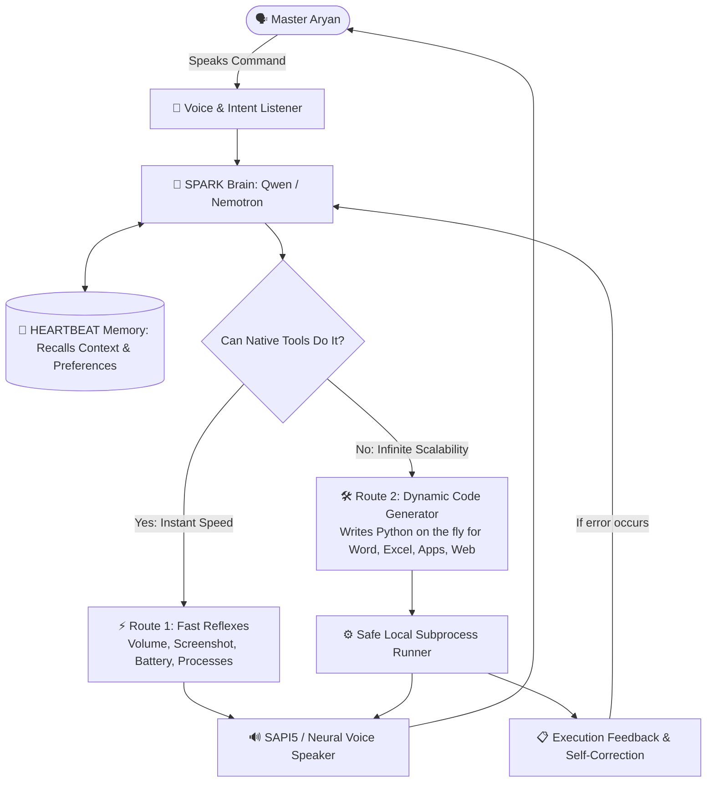

# ⚡ Project SPARK: The Blueprint to a Real JARVIS
*An Engineering Implementation Plan for Master Aryan*

---

## 🌟 What Does a "Real JARVIS" Actually Look Like?

In the movies, Tony Stark doesn't click buttons or write code. He simply speaks to JARVIS in plain English:
> *"JARVIS, create a new simulation, pull up the schematics, and notify me when the render is complete."*

To make **SPARK** do this in the real world on your Windows laptop, SPARK must have **4 Pillars**:
1. **The Ears & Voice**: Hear you accurately, speak naturally, and stop talking instantly if you interrupt.
2. **The Memory Core (HEARTBEAT)**: Remember conversations from yesterday, your preferences, and past files.
3. **The Multi-Step Brain (Metacognition)**: Break big instructions into small steps, and fix its own mistakes if something fails.
4. **The Infinite Hands (Dynamic Execution)**: Never say *"I don't know how to do that"*. If a tool doesn't exist, SPARK writes and runs a Python script on the fly to get it done.



---

## 🏗️ Phase 1: The Infinite Hands (Dynamic Code Execution)
**Goal:** Give SPARK the power to perform **any** laptop task without hardcoding.

### 1.1 The Two Routes
* **Route 1 (Fast Reflexes)**:
  * For common actions like changing the volume, muting, getting battery status, taking a screenshot, or listing processes.
  * Runs in **under 50 milliseconds** because it uses pre-written Python functions.
* **Route 2 (Dynamic Automation Fallback)**:
  * For unique requests (e.g., *"Open Word and write a letter"*, *"Extract all ZIP files in Downloads"*, *"Make an Excel sheet for my daily budget"*).
  * SPARK writes a fresh, standalone Python script, saves it to `spark_dynamic_execution.py`, runs it via Windows subprocess, reads the output, and deletes the temporary script.

### 1.2 Self-Installing Abilities (Zero-Crash Fallback)
If SPARK needs a special library that is not installed on your laptop (for example, `python-docx` for Word or `openpyxl` for Excel), the script SPARK writes will automatically install it first:
```python
try:
    import docx
except ImportError:
    subprocess.check_call([sys.executable, "-m", "pip", "install", "python-docx"])
    import docx
```
This guarantees SPARK **never crashes** just because a library was missing.

### 1.3 Safety Guardrails (The Jarvis Shield)
To ensure SPARK is safe and never harms your system:
* Blacklist dangerous commands (e.g., deleting system files like `C:\Windows\System32` or formatting drives).
* Run every script with a strict **45-second timeout** so it never hangs or freezes your computer.

### 1.4 🧠 Skill Crystallization (Self-Expanding Skills Library)
*Master Aryan's Key Insight: Never re-invent the wheel twice.*
* **First Time**: You ask for a new task (e.g. *"Write a report in Word"*). SPARK dynamically writes and executes the script.
* **Crystallization**: Once the script runs successfully, SPARK saves the function into a dedicated `skills/` library (e.g., `skills/word_toolkit.py`).
* **Second Time & Beyond**: Next time you say *"Write in Word"*, SPARK does **not** need to generate code from scratch! It immediately imports its tested skill, passes your new text as arguments, and finishes in **milliseconds**.
* **Result**: SPARK literally **learns new tools over time**. The more you use it, the smarter, faster, and more capable it becomes!

### 1.5 🖱️ Visual Cursor & Mouse Actuation (Live Screen Control)
*Master Aryan's Requirement: See SPARK physically pilot the laptop in real time.*
* **Smooth Cursor Gliding**: Instead of instant teleportation, SPARK moves the mouse pointer with smooth velocity (`duration=0.5s`) across the display so you can watch what it is doing with your own eyes.
* **Core Mouse Actuators**:
  * `mouse_move(x, y, duration=0.5)` — Glides the cursor to screen coordinates.
  * `mouse_click(button='left'|'right'|'double', x=None, y=None)` — Clicks buttons, icons, or menus.
  * `mouse_drag(start_x, start_y, end_x, end_y)` — Moves windows, sliders, or drags files into folders.
  * `mouse_scroll(clicks)` — Scrolls documents, feeds, or web pages up and down.
  * `get_cursor_position()` — Reports current mouse coordinate `(X, Y)`.
* **Universal App Control**: Even if an app has no API (like a specialized game, media player, or custom Windows settings menu), SPARK can see it on screen, glide the mouse to it, and click it.
* **Instant Safety Override (Failsafe)**: You always have ultimate control. If you grab your physical mouse or flick it into the corner of the screen, the automated cursor action instantly yields to you.

### 1.6 👻 Ghost Typing (Natural Keystroke Simulation)
*Master Aryan's Requirement: Watch text type itself dynamically onto the screen.*
* **Human-Speed & Super-Speed Modes**:
  * Instead of instant clipboard pasting, SPARK simulates realistic physical keystrokes with adjustable intervals (`interval=0.03s` - `0.06s`).
  * You see letters rapidly flow onto the screen inside Notepad, Word, browser inputs, or chat windows as if an invisible ghost is sitting at your physical keyboard.
* **Intelligent Special Keys**: Handles `Enter`, `Tab`, `Backspace`, `Ctrl+A`, `Ctrl+Z`, and indentation formatting automatically.

### 1.7 🚀 Recommended Elite Enhancements (The Tony Stark Suite)
1. **The "Eyes" of Jarvis (Screen OCR & Vision Target Finder)**:
   * SPARK takes a screenshot and uses OCR to find any text on your screen (e.g., locating where the "Download" or "Send" button is and clicking its exact center coordinates).
2. **Window Pilot (Auto-Focus & Smart Window Snapping)**:
   * Before typing or clicking, SPARK automatically brings the target app to the foreground (`win32gui.SetForegroundWindow`), and can snap windows side-by-side.
3. **JARVIS Acoustic Feedback (Sci-Fi Audio Chimes)**:
   * Subtle, sleek audio chimes:
     * *Wake Chime*: Soft futuristic chirp when SPARK starts listening.
     * *Success Blip*: Clean affirmative chime when an action completes.
4. **Proactive System Guardian (Ambient Health Warnings)**:
   * SPARK monitors vitals in the background and speaks up proactively:
     * *"Master Aryan, laptop battery has dropped to 15%. Recommend connecting your charger."*
     * *"Master Aryan, CPU temperature is exceeding 85°C. Would you like me to close background tasks?"*
5. **Emergency Hotkey Killswitch**:
   * A single master key (e.g. `Ctrl + Shift + K` or `ESC`) to instantly freeze all automated mouse gliding or ghost typing if you ever need to stop an action mid-flight.

### 1.8 📖 Active Document Reader & Explainer (Live Comprehension)
*Master Aryan's Scenario: A Word document (or PDF/article) is open on screen, and you want SPARK to read and explain it.*
* **Step 1: Live Memory Attachment (Win32 COM)**:
  * Because Word is already running on your laptop, SPARK connects directly to the running Word process in memory using `win32com.client.GetObject(Class="Word.Application")`.
  * It extracts the active document's text (or just highlighted text) instantly without even needing you to save or locate the file path!
* **Step 2: Universal Fallback (Screen Vision / Clipboard)**:
  * For PDFs or websites where COM isn't available, SPARK uses active window OCR or clipboard capture (`Ctrl+A` / `Ctrl+C`).
* **Step 3: Simplification & Breakdown (Cognitive Analysis)**:
  * SPARK reads the raw text, breaks down complex paragraphs, identifies main takeaways, and explains it in simple terms:
    > *"Master Aryan, this document is a project proposal for machine learning deployment. In simple words, section 2 explains that they need 3 servers, and section 3 outlines the budget. Here is what is confusing..."*
* **Step 4: Voice or Chat Delivery**: Speaks the summary clearly over your speakers or types a bulleted breakdown.

### 1.9 📚 Massive Document Handling (100+ Pages Without Breaking)
*Master Aryan's Challenge: What if the Word document has 50 to 500 pages of massive content?*
* **Strategy A: Hierarchical Chunking (Map-Reduce)**:
  * SPARK splits massive text by headings/sections into bite-sized 1,000-word chunks.
  * It generates quick bullet-point abstracts for each section, then synthesizes them into an **Executive 1-Page Master Summary** for you.
* **Strategy B: On-the-Fly Local RAG (Ask Anything in the Big Book)**:
  * For 200-page manuals or legal contracts, SPARK indexes the document into its local HEARTBEAT ChromaDB memory in 2 seconds.
  * You can treat the massive document like a conversation: *"SPARK, find where it talks about refund policy"* → SPARK pulls the exact paragraph and explains it immediately.
* **Strategy C: Selection Scoping ("Explain What I Highlighted")**:
  * If you're reading a massive file and get stuck on a single complex page, simply highlight it with your mouse and say: *"SPARK, explain what I highlighted"*. It pulls `word.Selection.Text` in 5ms!

### 1.10 🌐 The SPARK Multi-Agent Neural Cortex (Local Fleet + OpenCode Cloud)
*Master Aryan's Hardware & Cloud Roster Discovered on System:*

#### 🖥️ Local Fleet (Installed & Running on Laptop via Ollama):
1. **`qwen2.5:3b` (1.9 GB)** — *The Fast Reflex Operator*: Instant voice conversation, volume, battery, system status, fast file writes (~80ms latency).
2. **`qwen2.5-coder:3b` (1.9 GB)** — *The Local Code Synthesizer*: Writes standalone Python scripts and desktop automation offline.
3. **`qwen2.5vl:3b` (3.2 GB)** — *The Vision Eye (VLM)*: Directly analyzes screen screenshots, finds UI buttons, and reads on-screen text.
4. **`deepseek-r1:7b` (4.7 GB)** — *The Deep Cognitive Reasoner*: Multi-step planning (DAG), error self-healing, and complex problem solving.

#### ☁️ OpenCode Free Cloud Titans (Unlimited Intelligence, Zero Laptop Heat):
1. **`opencode/nemotron-3.5-lightning-free`** — *The Cloud Hyper-Coder*: Massive, flawless script synthesis and autonomous execution.
2. **`opencode/longcat-2.5-preview-free`** — *The Giant Document Reader*: Ultra-massive context window capable of reading entire 100+ page books, Word documents, and manuals in one shot.
3. **`opencode/nemotron-3-ultra-free`** — *The Supreme Logician*: Deepest intellectual synthesis and strategy.
4. **`opencode/mimo-v2.6-flash-free` & `opencode/ling-3.1-flash-free`** — Ultra-low latency cloud models.

---

#### 🧭 Smart Dynamic Routing Architecture:
```mermaid
graph TD
    User([🗣️ Master Aryan]) --> Router{🧭 SPARK Dynamic Router}
    
    Router -->|Voice, Volume, Hardware, Offline| LocalFast[⚡ qwen2.5:3b\nLocal Fast Reflexes]
    Router -->|Screen Sight & Visual Target Search| LocalVision[👁️ qwen2.5vl:3b\nLocal Screen Eye]
    Router -->|Complex Debugging & Multi-Step Logic| LocalR1[🧠 deepseek-r1:7b\nLocal Chain-of-Thought]
    Router -->|100+ Page Massive Docs & Heavy Code| CloudNemotron[☁️ OpenCode Cloud\nNemotron 3.5 & LongCat]
    
    LocalFast --> Execution[⚙️ High-Integrity Local Windows Execution]
    LocalVision --> Execution
    LocalR1 --> Execution
    CloudNemotron --> Execution
    
    Execution --> Memory[(🧬 HEARTBEAT Synaptic Memory)]
    Execution --> Voice[🔊 SAPI5 Voice Response]
    Voice --> User

### 1.11 🎓 Learning from Human Demonstration (Show & Learn / Shadow Mode)
*Master Aryan's Masterpiece: If SPARK makes a mistake, you show it with your mouse, and it learns permanently.*
* **Step 1: Interactive Progress Check-In**:
  * When SPARK completes or previews an action (e.g. creating a Word document, highlighting points):
  * It visually displays the result and asks Master Aryan:
    > *"Master Aryan, I have prepared the document and extracted the main AI principles. Is this looking correct to you, sir, or would you like to guide me?"*
* **Step 2: Demonstration Recording Mode (`tool_record_user_demonstration`)**:
  * If you say: *"No, let me show you how to do it"*:
  * SPARK enters **Shadow Recording Mode** via background input listeners (`pynput`):
    * Records the exact sequence of windows you click.
    * Records the button coordinates and keystrokes you type.
    * Master Aryan finishes the demo and presses `ESC` or says *"Done"*.
* **Step 3: Code Synthesis & Permanent Crystallization**:
  * SPARK compiles your recorded demonstration into a clean, parameterized Python script.
  * Saves it into `skills/learned_user_demonstrations.py`.
* **Step 4: Autonomous Replication**:
  * Next time you give that command, SPARK announces:
    > *"Executing task using the technique you taught me, Master Aryan."*
  * It reproduces your exact mouse clicks, selections, and formatting automatically!

### 1.12 👑 The 4 Elite Jarvis Pillars (Pillars of Phase 2)
1. **⚓ Action Replay with Semantic Anchoring**:
   * Uses `win32gui.WindowFromPoint` to capture the target **Window Title** and **Relative Window Coordinates**.
   * Replays actions reliably even if windows are moved, resized, or displayed on different monitors.
2. **⏪ Undo & Rollback Safety Checkpoint System**:
   * Saves instant file snapshots into `data/checkpoints/` before any dynamic code modifies disk assets.
   * Master Aryan can say *"SPARK, undo that"* to restore original files in 10 milliseconds.
3. **🌅 Autonomous Daily Morning Briefing**:
   * On startup, SPARK inspects battery, RAM, yesterday's SQLite memory records, and newly crystallized skills.
   * Speaks a polished, executive morning status report aloud over SAPI5.
4. **🎯 Visual Grounding via Set-of-Marks (SoM)**:
   * Overlays transparent numbered coordinate tags on screenshots for `qwen2.5vl:3b` visual target identification.

---

## 🧬 Phase 2: The Living Memory Core & 4 Elite Pillars (HEARTBEAT)
**Goal:** Make sure SPARK never forgets what you told him yesterday, last week, or 10 minutes ago, backed by semantic anchoring, checkpoints, morning briefing, and SoM visual grounding.

### 2.1 The 3-Tier Storage Hierarchy
1. **Tier 1 (Instant Working Memory - RAM)**:
   * Uses the `LRUMemoryCache` and `PrefixTrie` we built to find recent notes, active file names, and conversation context in **0.1 milliseconds**.
2. **Tier 2 (Long-Term Episodic Memory - SQLite)**:
   * Every conversation, tool execution, and user preference is permanently logged in `storage/heartbeat_memory.db`.
3. **Tier 3 (Subconscious Vector Association - ChromaDB)**:
   * Uses semantic embeddings (`all-MiniLM-L6-v2`) so if you say:
     > *"Spark, where did we put that draft about the college project?"*
     Even if you don't say the exact filename, SPARK understands the meaning and finds it.

### 2.2 Synaptic Priming (Learning Your Habits)
When you ask SPARK to do something repeatedly (e.g., opening a specific folder every morning or playing your favorite music), the biological Hebbian synapses strengthen. SPARK will start anticipating what you need before you even ask.

---

## 🧩 Phase 3: The Multi-Step Brain (Task DAG & Self-Healing)
**Goal:** Handle complex, multi-stage requests and fix its own errors.

### 3.1 Breaking Big Tasks into Steps (Task Execution DAG)
If you give a big command:
> *"SPARK, take a screenshot of my screen, save it to my desktop, and summarize the active window in a text file."*

SPARK doesn't try to guess everything at once. It creates an internal **Directed Acyclic Graph (DAG)**:
* **Step 1**: Call `take_screenshot` → Save to desktop.
* **Step 2**: Read active window title via Win32.
* **Step 3**: Call `write_workspace_file` with the summary.
* **Step 4**: Announce completion to Master Aryan.

### 3.2 Self-Healing Loop (Autonomous Debugging)
If SPARK generates a script that fails (for example, a typo in a file path or a blocked window):
1. SPARK captures the error message (`stderr`).
2. SPARK feeds the error back into its own brain: *"That failed because the file path had spaces. Let me fix the quotes and try again."*
3. It fixes the script and reruns it automatically **without asking you to fix the code**.

---

## 🎙️ Phase 4: Voice & Speech Presence
**Goal:** Fast, smooth vocal interaction worthy of JARVIS.

1. **Low-Latency Speech Recognition**:
   * Uses microphone threshold tuning so SPARK doesn't miss words or cut you off mid-sentence.
2. **Native Speech Engine (SAPI5 / Neural TTS)**:
   * Zero cloud lag. Speaks locally through your laptop speakers instantly.
3. **Barge-In (Interruption Detection)**:
   * If SPARK is speaking a long sentence and you say *"Stop"* or start giving a new order, SPARK cuts off speech immediately and listens to you.

---

## 📅 Master Multi-Phase Implementation Roadmap

| Phase | Core Objective | Key Deliverables & Actuators | Status |
| :--- | :--- | :--- | :--- |
| **Phase 1** | **Infinite Hands & Physical Actuation** | Dynamic Subprocess Runner, Skill Crystallizer (`skills/`), Smooth Cursor Gliding, Ghost Typing, Active Word Reader, Show & Learn (`pynput`) | **COMPLETED & VERIFIED** ✅ |
| **Phase 2** | **Living Memory Core & 4 Elite Pillars** | 1. Semantic Window Anchoring<br>2. Undo & Rollback Checkpoints (`tool_create_checkpoint`, `tool_undo_last_action`)<br>3. Autonomous Morning Briefing (`tool_generate_morning_briefing`)<br>4. Visual Grounding SoM (`tool_take_marked_screenshot`)<br>5. 3-Tier Storage (RAM / SQLite / ChromaDB) & Multi-Model Cognitive Router | **COMPLETED & VERIFIED** ✅ |
| **Phase 3** | **Task DAG & Self-Healing Brain** | Directed Acyclic Graph planner (`tool_execute_dag_plan`), Kahn's topological wave execution, autonomous `stderr` debugger (`heal_code_with_llm`, `tool_diagnose_and_heal_script`) & self-healing execution retry | **COMPLETED & VERIFIED** ✅ |
| **Phase 4** | **Voice Presence & Barge-In** | Low-latency speech recognition (`r.pause_threshold=0.6s`), SAPI5 async dispatch, `stop_speaking` Barge-In purge, and Sci-Fi feedback chimes (`play_chime`) | **COMPLETED & VERIFIED** ✅ |
| **Phase 5** | **Live Master Aryan Verification** | Full end-to-end interactive test: Word summarization, key points doc, demonstration replay | **READY FOR ACTIVATION** 🚀 |

---

## 🎯 Verification Criteria: How We Know It Works 100%
1. **Scenario A (Native Route)**: *"SPARK, set system volume to 35%"* → Executes directly in < 50ms without generating any script.
2. **Scenario B (Dynamic Arbitrary Route)**: *"SPARK, create a Word file named 'Jarvis_Report.docx' on my Desktop and write 'Autonomous system operational' inside."* → SPARK generates code on the fly, auto-installs `docx` if needed, creates the file, opens it on screen, and announces success.
3. **Scenario C (Memory Recall)**: *"SPARK, what did we just create?"* → Pulls the memory from HEARTBEAT and answers accurately.
